# BattleTech Campaign Engine (BCE)

**Play it:** https://bcengine.org · **Free, no ads, no accounts sold, ever.** Sign in with Google, or play as a guest with a recovery code.

BCE is a campaign manager and table companion for classic BattleTech. You run a mercenary company — contracts, negotiation, a mission tree that branches on how the fight actually went, a warchest, repairs, pilots who get better or get hurt — and when it's time to play the fight on the table, every player pulls up their record sheet on their phone, marks damage, and the results flow back into the campaign. It's built on top of the MekBay unit viewer, so every unit in the MegaMek catalog is in it with a real record sheet.

It started because I run a table and was tired of the bookkeeping. It's been played weekly at my table for months and tested hard by one very patient volunteer. Now it's yours too.

## What's in it

**Classic campaign** — the traditional merc loop: take a contract from the market, generate a mission with the Forge, deploy a force, fight it, resolve it, repair, get paid. Combined-arms toggle for vehicles and infantry. After-action reports written from what happened.

**Hot Spots** — a Chaos Campaign / Draconis Reach-style mode. A star map with real system data, an offer board of authored contracts, two-sided pick-a-side offers, book-exact term negotiation, a branching track tree where the next track depends on how you did on the last one, two-sided victory-point resolve, per-pilot progression paid from the warchest, and a Market and OpFor hard-gated to each faction's Master Unit List for the era.

**The table** — a GM screen with a claims board (who's flying what), a session code and QR for players to join, live damage from every phone in the room, an END PHASE step so nothing lands until the player says so, and a resolve that reads the actual state of the sheets.

**Player phone** — your roster, your record sheet with heat and criticals, your results slip. Nothing to install.

## Screenshots

| | |
|---|---|
| 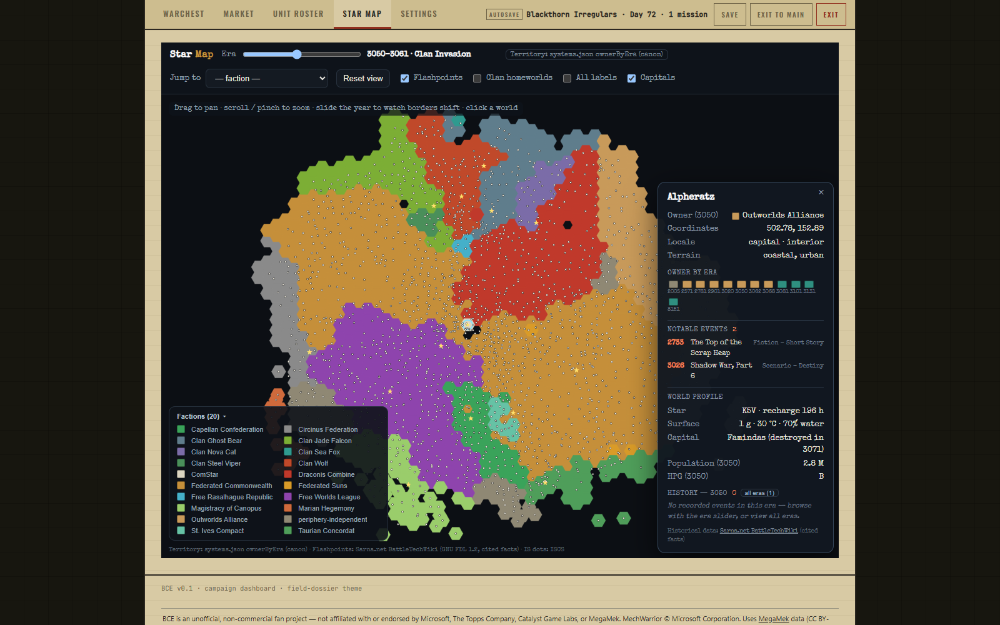 The star map | 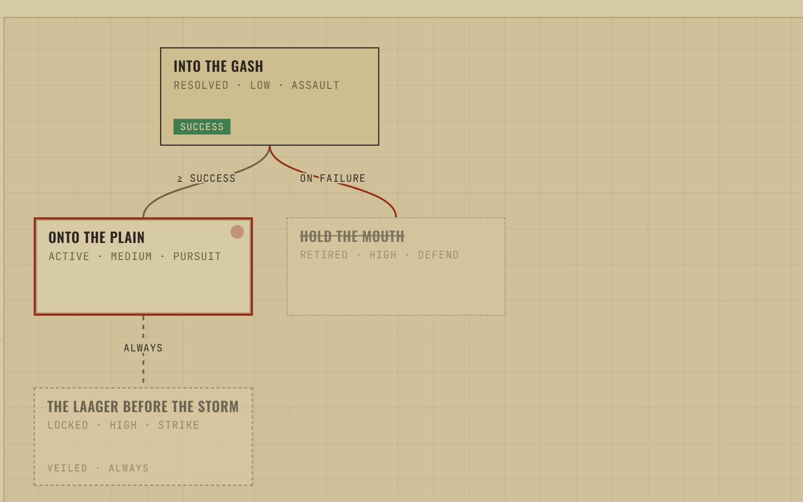 A contract's track tree |
| 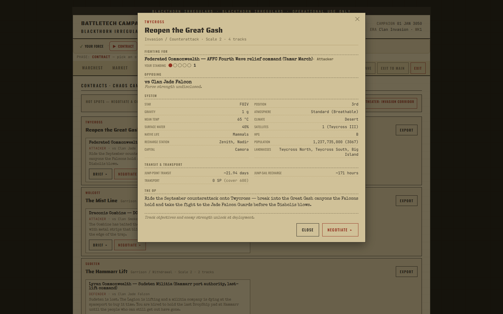 An offer brief | 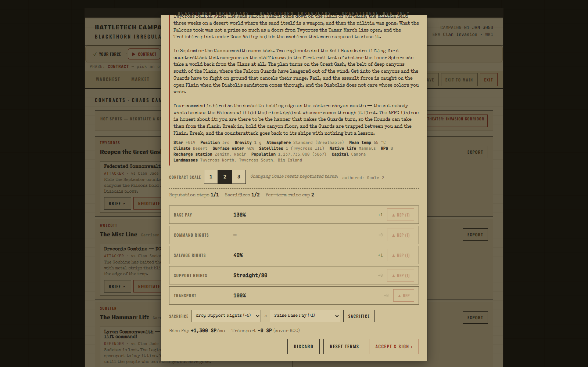 Negotiating terms |
| 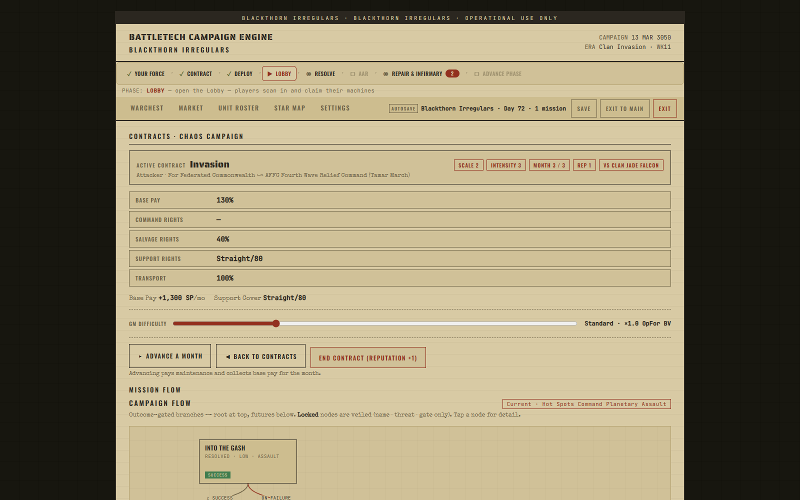 The contract, in progress | 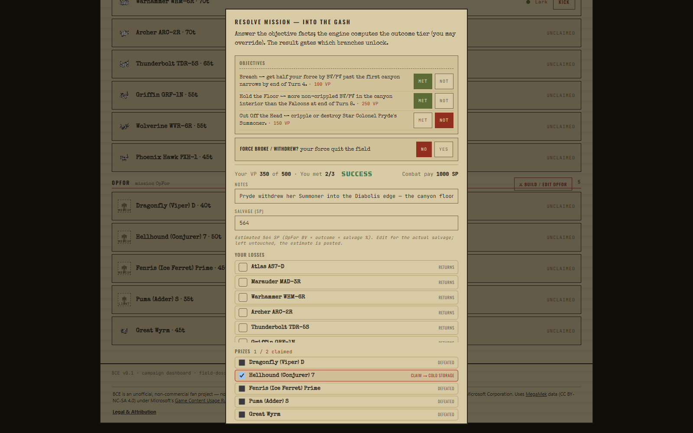 Resolving a mission — objectives, VP, salvage, prizes |
| 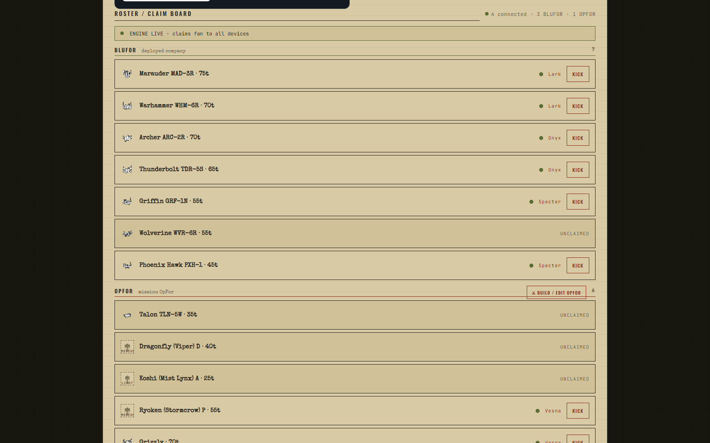 The GM's claims board | 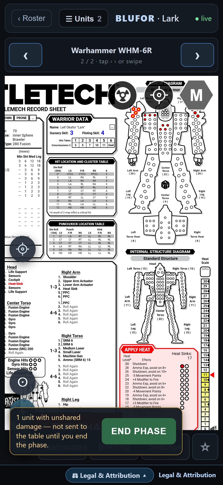 A player's record sheet, on a phone |
| 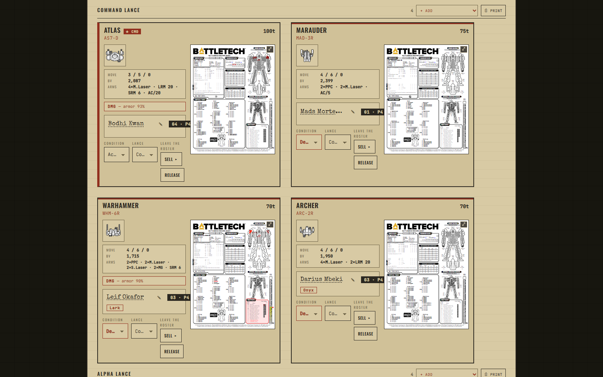 The unit roster | 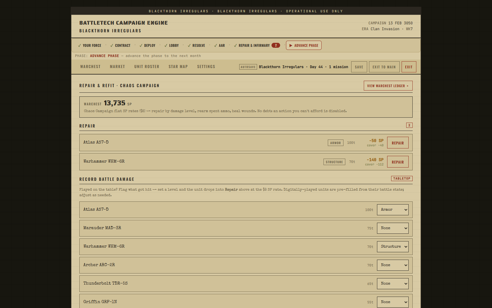 Repair and refit |
| 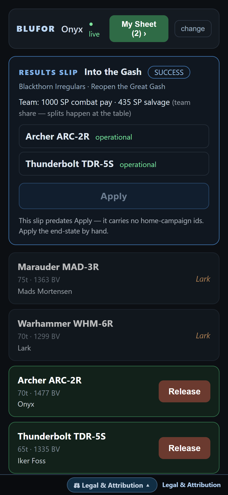 A results slip | 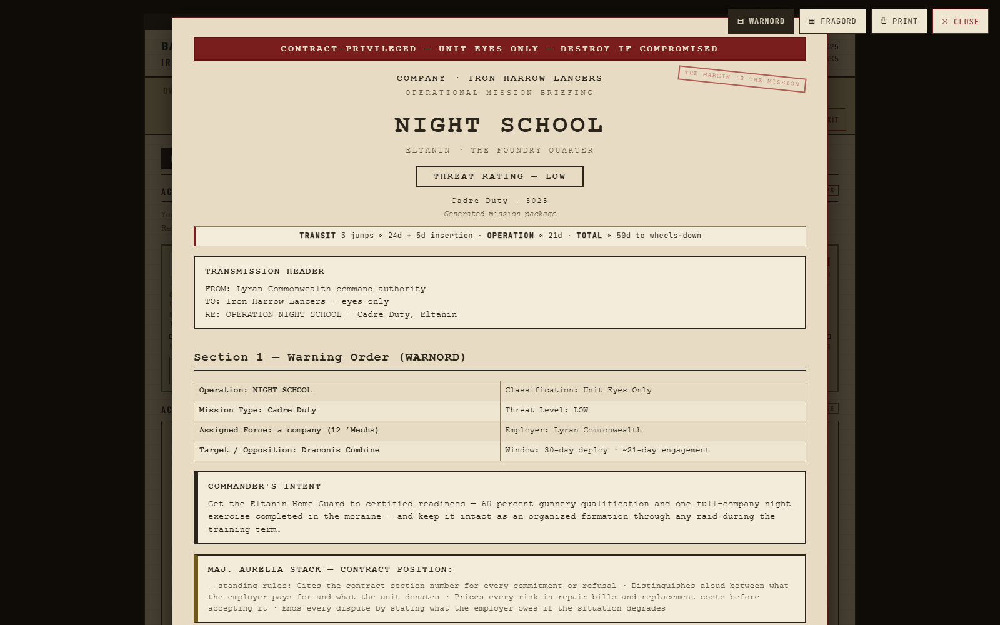 A Classic Forge brief |

## Status

Alpha, and honest about it. The core loop works and gets played every week. Rough edges exist, mostly in the places one tester and one GM never wandered into. If something breaks, the footer of the app names the failing part — paste that line into an issue and it'll get fixed fast.

## How to help

This is a community build and it needs more than one person's imagination.

- **Write missions.** Hot Spots contracts are authored in a JSON pack — a world, an employer, two sides, a few tracks with objectives and forks. If you can write a good three-paragraph situation and know what a Defend or an Objective Raid feels like on the table, you can author one. See [`CONTRIBUTING.md`](CONTRIBUTING.md) for the shape and the one hard rule (your own words — nothing copied from a book).
- **Play it and say what broke.** A GitHub issue with what you did, what you expected, and the footer line is worth an hour of my time. Phone screenshots welcome.
- **Code.** TypeScript throughout — Angular on the front, NestJS on the back, SQLite under it. Build instructions below. Open a discussion before a big change so we don't collide.
- **Content you already have.** Ran a campaign somewhere the app doesn't cover yet? Ideas and your own written material are welcome; book text isn't.

Discussions are open on this repo. Issues for bugs, Discussions for everything else.

## A straight answer about how it was built

I'm one person with a day job. A large share of this code was written with AI coding tools, directed and tested by me, and every mechanic in it has been run at a real table before it shipped. I'm not going to pretend otherwise, and I'm not going to apologize for it either — the tool exists because that's what let one GM build it. Judge it by whether it makes your campaign better.

## Build

```sh
npm install                    # the workspace root (Nx + the api toolchain)
npm --prefix apps/web install  # the web app's own toolchain (the vendored MekBay fork keeps its own package.json)
npx nx build api
npx nx build web
```

Requires Node 24.x and network access on the first `nx build web`: its `prerun` step regenerates build metadata, asset indexes and sprites, then fetches the **MekBay unit-catalog data** (`units.json`, `equipment2.json`, `quirks.json`, `factions.json`, `eras.json`, `units_sources.json`) from MekBay's public data service (`https://db.mekbay.com`, overridable via `BCE_MIRROR_SRC`) into `apps/web/public/mekbay/` and derives the per-era slices. That catalog is **MegaMek/MekBay data (CC BY-NC-SA 4.0)** — it is deliberately **not stored in this GPLv3 repository**; the build fetches it from upstream, exactly as the deployed site's build does. The optional R2 upload step is skipped automatically when no `R2_*` credentials are present.

`apps/api` — the server-authoritative engine + REST/WebSocket API (NestJS + SQLite). `apps/web` — the web frontend and player companion (Angular, derived from MekBay). Each app's `project.json` lists its build/serve targets.

## License & Attribution

BCE is free software licensed under the **GNU General Public License v3.0** — see [`LICENSE`](LICENSE). The complete corresponding source is published in this repository. **BCE is and will remain non-commercial.**

Unit data, record sheets, and sprites are derived from the **MegaMek Data Repository** (https://github.com/MegaMek/mm-data), licensed **CC BY-NC-SA 4.0**. The frontend is derived from **MekBay** (https://github.com/MegaMek/mekbay); upstream MegaMek/MekBay copyright notices are retained in the source. Thank you to both projects — none of this exists without them.

MechWarrior, BattleMech, `Mech, and BattleTech are trademarks of **The Topps Company, Inc.** Catalyst Game Labs and its logo are trademarks of **InMediaRes Productions, LLC.** MechWarrior © **Microsoft Corporation** — this project was created under Microsoft's "Game Content Usage Rules" (https://www.xbox.com/en-US/developers/rules) and is not endorsed by or affiliated with Microsoft, Topps, Catalyst, or MegaMek.

Full notices: [`NOTICE.md`](NOTICE.md) and the in-app **Legal & Attribution** page.
